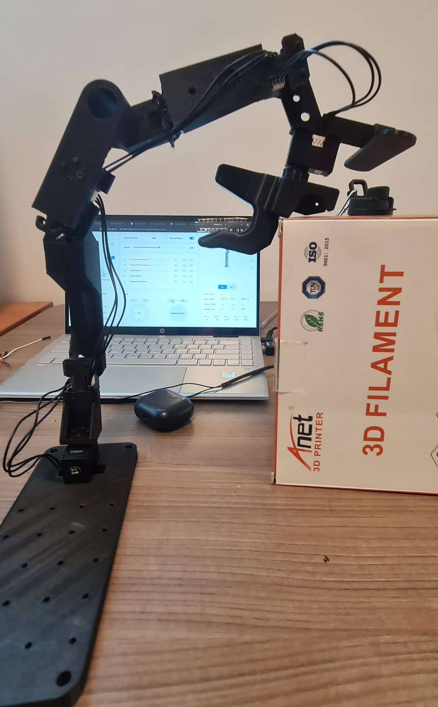
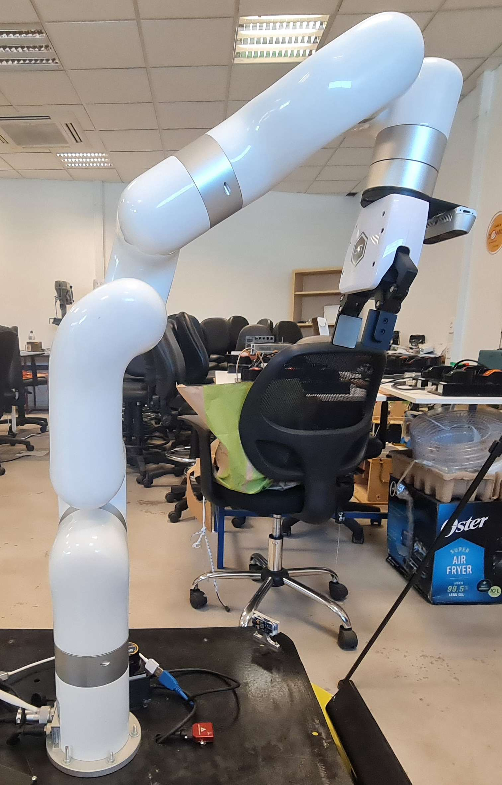

# Este repositorio es un fork de [GELLO: General, Low-Cost, and Intuitive Teleoperation Framework](https://github.com/wuphilipp/gello_software)
<p align="center">
  
</p>

El presente brazo robótico y repositorio, está completamente dedicado a su aplicación al brazo de Ufactory xArm5. Este brazo de **teleoperación orientado a las técnicas de aprendizaje por imitación** fué realizado en la **Universidad Católica del Norte**

## Guía paso a paso para instalarlo (Linux o en su defecto, utilizar WSL en Windows)

```bash
git clone https://github.com/AlbertoLyons/gello_software_xarm5
cd gello_software_xarm5
```

## Hardware

El hardware para la impresión 3D de las piezas se encuentra en el siguiente enlace de [Google Drive](https://drive.google.com/drive/folders/1hclzPd8Af86EfOTpyxp-Hj-FXV_-R4Te?usp=sharing)

## Instalación

Instalar antes de todo uv:
```bash
curl -LsSf https://astral.sh/uv/install.sh | sh
```

Instalar SDK de xArm:
- **xArm**: [xArm Python SDK](https://github.com/xArm-Developer/xArm-Python-SDK)


Crear entorno virtual en python:
```bash
uv venv --python 3.11
source .venv/bin/activate  # Ejecutarlo cada vez que se inicia una nueva terminal
git submodule init
git submodule update
uv pip install -r requirements.txt
uv pip install -e .
uv pip install -e third_party/DynamixelSDK/python
```
#### Configuración de componentes

- **Robot Config**: Define el tipo de robot, parametros de comunicación, y opciones físicas.
- **Agent Config**: Define la configuración del agente GELLO, mapeos de las junturas y calibración.
- **DynamixelRobotConfig**: Configuraciones específicas de los motores, incluyendo ID, offsets, signos, y el agarre.
- **Control Parameters**: Tasa de refrezco (`hz`), límite de pasos (`max_steps`), y opciones de seguridad.

## Configuración de inicio

#### 1. Inicializar `gello_agent`
Establece al agente GELLO y el brazo en una configuración igual o similar en dimensiones (ver imagenes como referencia abajo), anote los valores de ángulos de las junturas en **radianes**, y ejecute el siguiente script:

<p align="center">
  
  
</p>

**Ejemplo de comando:**

**xArm5:**
```bash
python scripts/gello_get_offset.py \
    --start-joints 0.0820 0 -2.1293 2.3387 0  \
    --joint-signs 1 1 -1 1 1  \
    --port /dev/serial/by-id/usb-1a86_USB_Single_Serial_5AF6000708-if00
```

**Signos de juntura para el xArm5:**
- xArm: `1 1 -1 1 1`

Escriba los offsets generados al siguiente script: `gello/agents/gello_agent.py` en la clase `PORT_CONFIG_MAP`.

## Ejecución de la teleoperación

### Ejecutar `gello_agent` 

**1. Ejecutar el nodo del robot:**
```bash
# Para simulación en MuJoCo
python experiments/launch_nodes.py --robot <sim_xarm|sim_xarm_no_arm>

# Para un brazo real
python experiments/launch_nodes.py --robot <xarm|xarm_no_arm>
```

**2. Ejecutar el controlador GELLO:**
```bash
python experiments/run_env.py --agent=gello
```

### Toma de datos

Para tomar y recolectar datos de la teleoperación con el fin de usarlos en técnicas de aprendizaje por imitación, se debe de ejecutar el siguiente script para el nodo del agente GELLO:

```bash
python experiments/run_env.py --agent=gello --use-save-interface
```

Para empezar a recolectar datos, se debe de iniciar la interfaz gráfica, y apretar la tecla 's'. Para terminar de recolectar los datos, se debe de apretar la tecla 'q'.